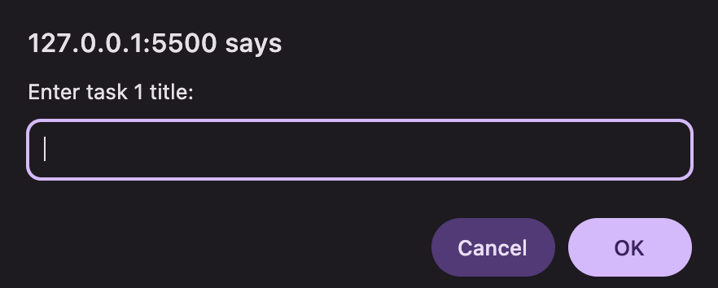
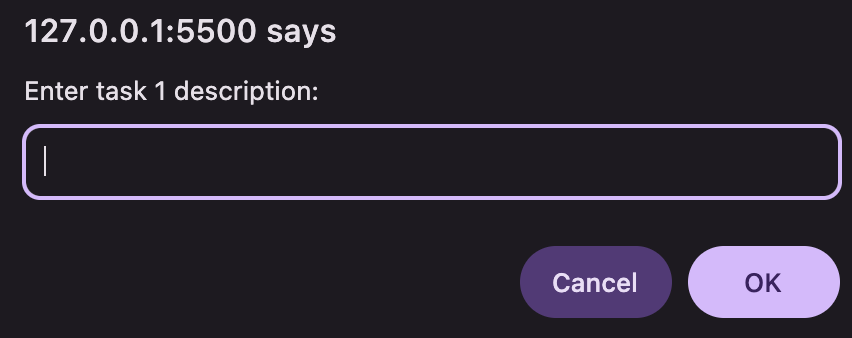
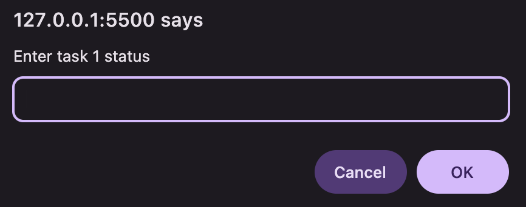
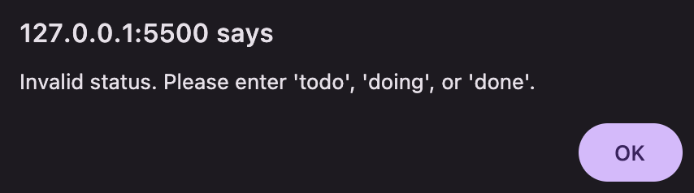
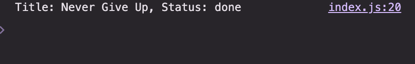
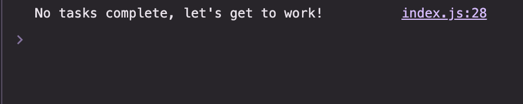

## 📈Task Input and Status Validation System📉

## 💡 Overview

I built a small JavaScript task-entry tool. It walks me through adding two tasks—each with a title, description, and a status (todo, doing, or done). The script validates inputs, normalizes formatting (e.g., casing), and guards against invalid statuses. I kept the code straightforward and maintainable so it’s easy to read, extend, and reuse.

---

## 🚀 Features & Objectives

**Interactive Task Input** — On page load, it prompts for two tasks and collect a title, description, and status for each.
**Status Validation** — It only accept todo, doing, or done. If anything else is entered, it will show an alert and keep prompting until a valid status is provided.
**Case-Insensitive Handling** — It accept inputs like TODO, doing, or Done and normalize them to lowercase, keeping the code consistent.
**Console Output** — If any tasks are marked done, it will log their title and status to the console; if none are done, it will print a motivational message
**Maintainable Code** — I keep HTML, CSS, and JavaScript in separate files for clarity and easy maintenance.

---

## ⛏️ Tech Stack

---

## 🎯 Expected Outcome

A task entry system that reliably captures, validates, and structures task data, with clear documentation and maintainable code for future changes.

---

## 📊 Prompt Input Examples

- The program must prompt users for task 1 title, descrition and status inputs, it must do the same for task 2 information

  
  
  

**Invalid status**

- If the user enters a status other than `todo`, `doing` or `done`, the program must alert the user of this and return to prompting them to enter a status.

  

**Console log**

- When there is a completed task:

  

- When there are no completed tasks:

  

---

## 👩‍🏫Setup and Running Instructions

Follow these steps to get the project running on your local machine:

**1. Clone the Repository**
First, clone the repo from GitHub

**2. Navigate into the Project**
Move into the project folder

**3. Open in VS Code (or editor of choice)**
If you’re using Visual Studio Code, open the project with:
code .